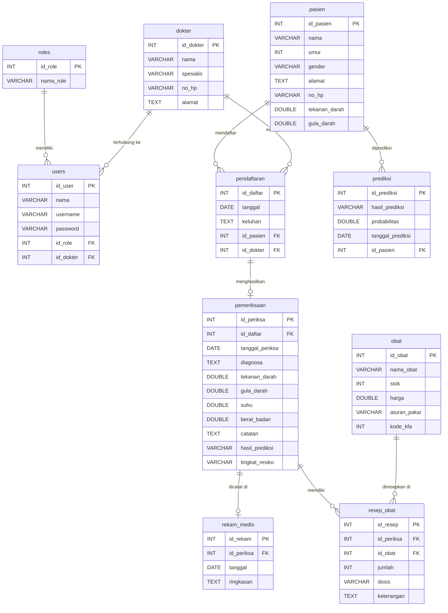

```mermaid
erDiagram
    roles {
        INT id_role PK
        VARCHAR nama_role
    }
    users {
        INT id_user PK
        VARCHAR nama
        VARCHAR username
        VARCHAR password
        INT id_role FK
        INT id_dokter FK
    }
    dokter {
        INT id_dokter PK
        VARCHAR nama
        VARCHAR spesialis
        VARCHAR no_hp
        TEXT alamat
    }
    pasien {
        INT id_pasien PK
        VARCHAR nama
        INT umur
        VARCHAR gender
        TEXT alamat
        VARCHAR no_hp
        DOUBLE tekanan_darah
        DOUBLE gula_darah
    }
    obat {
        INT id_obat PK
        VARCHAR nama_obat
        INT stok
        DOUBLE harga
        VARCHAR aturan_pakai
        INT kode_kfa
    }
    pendaftaran {
        INT id_daftar PK
        DATE tanggal
        TEXT keluhan
        INT id_pasien FK
        INT id_dokter FK
    }
    pemeriksaan {
        INT id_periksa PK
        INT id_daftar FK
        DATE tanggal_periksa
        TEXT diagnosa
        DOUBLE tekanan_darah
        DOUBLE gula_darah
        DOUBLE suhu
        DOUBLE berat_badan
        TEXT catatan
        VARCHAR hasil_prediksi
        VARCHAR tingkat_resiko
    }
    rekam_medis {
        INT id_rekam PK
        INT id_periksa FK
        DATE tanggal
        TEXT ringkasan
    }
    resep_obat {
        INT id_resep PK
        INT id_periksa FK
        INT id_obat FK
        INT jumlah
        VARCHAR dosis
        TEXT keterangan
    }
    prediksi {
        INT id_prediksi PK
        VARCHAR hasil_prediksi
        DOUBLE probabilitas
        DATE tanggal_prediksi
        INT id_pasien FK
    }

    roles ||--o{ users : "memiliki"
    dokter ||--o{ users : "terhubung ke"
    pasien ||--o{ pendaftaran : "mendaftar"
    dokter ||--o{ pendaftaran : "melayani"
    pendaftaran ||--o| pemeriksaan : "menghasilkan"
    pemeriksaan ||--o| rekam_medis : "dicatat di"
    pemeriksaan ||--o{ resep_obat : "memiliki"
    obat ||--o{ resep_obat : "diresepkan di"
    pasien ||--o{ prediksi : "diprediksi"
```
