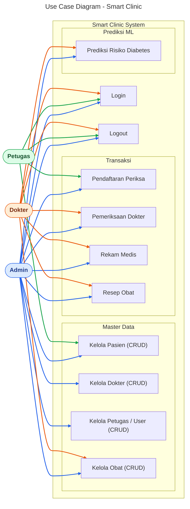

```mermaid
---
title: Use Case Diagram - Smart Clinic
---
graph LR
    Admin([" Admin"])
    Petugas([" Petugas"])
    Dokter([" Dokter"])

    subgraph SmartClinic["Smart Clinic System"]
        UC1["Login"]
        UC2["Logout"]

        subgraph Master["Master Data"]
            UC3["Kelola Pasien (CRUD)"]
            UC4["Kelola Dokter (CRUD)"]
            UC5["Kelola Petugas / User (CRUD)"]
            UC6["Kelola Obat (CRUD)"]
        end

        subgraph Transaksi["Transaksi"]
            UC7["Pendaftaran Periksa"]
            UC8["Pemeriksaan Dokter"]
            UC9["Rekam Medis"]
            UC10["Resep Obat"]
        end

        subgraph Prediksi["Prediksi ML"]
            UC11["Prediksi Risiko Diabetes"]
        end
    end

    %% Admin (biru) - link index 0-10
    Admin --> UC1
    Admin --> UC2
    Admin --> UC3
    Admin --> UC4
    Admin --> UC5
    Admin --> UC6
    Admin --> UC7
    Admin --> UC8
    Admin --> UC9
    Admin --> UC10
    Admin --> UC11

    %% Petugas (hijau) - link index 11-14
    Petugas --> UC1
    Petugas --> UC2
    Petugas --> UC3
    Petugas --> UC7

    %% Dokter (orange) - link index 15-21
    Dokter --> UC1
    Dokter --> UC2
    Dokter --> UC6
    Dokter --> UC8
    Dokter --> UC9
    Dokter --> UC10
    Dokter --> UC11

    %% Warna garis per aktor
    %% Admin = biru (#2563eb)
    linkStyle 0 stroke:#2563eb,stroke-width:2px
    linkStyle 1 stroke:#2563eb,stroke-width:2px
    linkStyle 2 stroke:#2563eb,stroke-width:2px
    linkStyle 3 stroke:#2563eb,stroke-width:2px
    linkStyle 4 stroke:#2563eb,stroke-width:2px
    linkStyle 5 stroke:#2563eb,stroke-width:2px
    linkStyle 6 stroke:#2563eb,stroke-width:2px
    linkStyle 7 stroke:#2563eb,stroke-width:2px
    linkStyle 8 stroke:#2563eb,stroke-width:2px
    linkStyle 9 stroke:#2563eb,stroke-width:2px
    linkStyle 10 stroke:#2563eb,stroke-width:2px

    %% Petugas = hijau (#16a34a)
    linkStyle 11 stroke:#16a34a,stroke-width:2px
    linkStyle 12 stroke:#16a34a,stroke-width:2px
    linkStyle 13 stroke:#16a34a,stroke-width:2px
    linkStyle 14 stroke:#16a34a,stroke-width:2px

    %% Dokter = orange (#ea580c)
    linkStyle 15 stroke:#ea580c,stroke-width:2px
    linkStyle 16 stroke:#ea580c,stroke-width:2px
    linkStyle 17 stroke:#ea580c,stroke-width:2px
    linkStyle 18 stroke:#ea580c,stroke-width:2px
    linkStyle 19 stroke:#ea580c,stroke-width:2px
    linkStyle 20 stroke:#ea580c,stroke-width:2px
    linkStyle 21 stroke:#ea580c,stroke-width:2px

    %% Style node aktor
    classDef adminStyle fill:#dbeafe,stroke:#2563eb,color:#1e3a8a,font-weight:bold
    classDef petugasStyle fill:#dcfce7,stroke:#16a34a,color:#14532d,font-weight:bold
    classDef dokterStyle fill:#ffedd5,stroke:#ea580c,color:#7c2d12,font-weight:bold

    class Admin adminStyle
    class Petugas petugasStyle
    class Dokter dokterStyle
```
